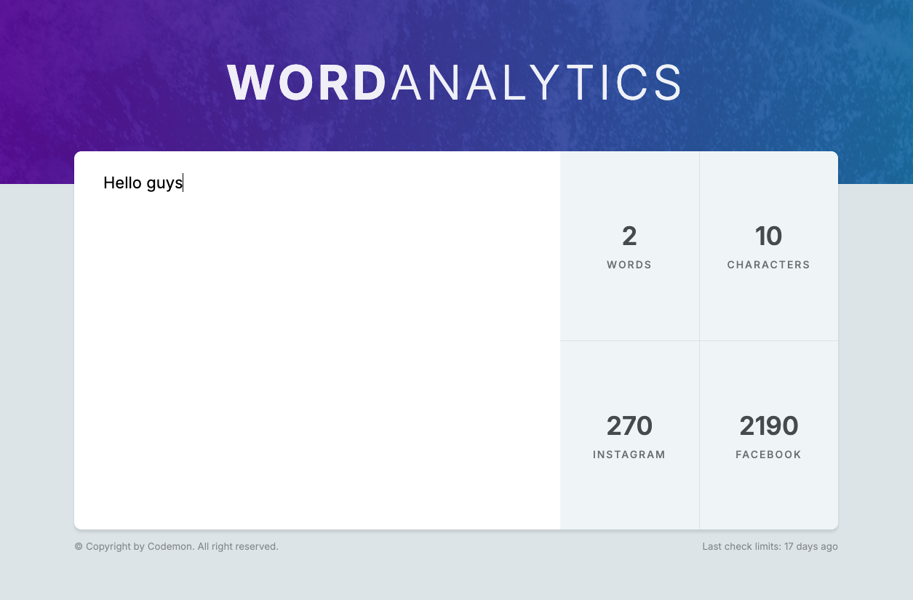

# WordAnalytics

WordAnalytics is a web app designed to simplify the process of writing social media posts. With real-time word and character count, and limits tailored for platforms like Instagram and Facebook, users can ensure their posts are within the platform limits—removing the frustration of constant edits. Built using both React and Vue, this app serves as an intuitive tool to improve social media productivity and accuracy.

## Table of Contents

- [Story Behind the Project](#story-behind-the-project)
- [Features](#features)
- [Demo](#demo)
- [Usage](#usage)
- [Project Structure](#project-structure)
- [Technologies Used](#technologies-used)

## Story Behind the Project

### The Problem

In today’s world, social media platforms are an integral part of how we communicate, express ourselves, and engage with audiences. But every platform comes with its own restrictions: Instagram has a 2,200 character limit, while Facebook allows much more. For many users, crafting the perfect post can be a source of frustration—trying to strike the balance between creativity and word count.

### The Solution

After seeing people struggle repeatedly with word and character limits—especially when composing Instagram captions or Facebook posts—I realized there needed to be a better way. WordAnalytics was born to take away the hassle and uncertainty of whether your post fits within platform limits.

By providing real-time word and character count as you type, and visually showing how much space you have left, WordAnalytics simplifies the process of writing a perfect post—every time.

## Features

- **Real-Time Word & Character Count:** As you type, the app updates the number of words and characters in your post.
- **Platform-Specific Limits:** Provides limits based on social media platform rules (Instagram, Facebook).
- **Countdown Indicators:** Displays how many characters you have left before reaching the platform's limit.
- **Responsive Design:** Easy-to-use interface on both desktop and mobile devices.
- **Clear and User-Friendly UI:** No distractions, just clean functionality to ensure your post fits perfectly.

## Demo

A live demo of the application is available at: [Word Analytics link](https://word-analytics-web-application.vercel.app/
)



## Usage

1. Open the web app in your browser.
2. Start typing your post in the provided text area.
3. As you type, you’ll see the word count, character count, and the remaining characters available for platforms like Instagram and Facebook.
4. Adjust your post until it fits within the desired platform's character limit.

## Technologies Used

### Frontend:
- React (or Vue)
- Vite
- CSS

### Development Tools:
- JavaScript (ES6+)
- Node.js
- npm
## Project Structure

```bash
wordanalytics/
├── public/             # Static assets
├── src/
│   ├── components/     # React or Vue components
│   ├── App.jsx         # Main app component for React
│   ├── App.vue         # Main app component for Vue (depending on your build)
│   ├── index.css       # Global styles
│   ├── main.jsx        # Entry point for React
│   ├── main.js         # Entry point for Vue
├── .gitignore          # Git ignore file
├── package.json        # Project metadata and scripts
└── vite.config.js      # Vite configuration
```
